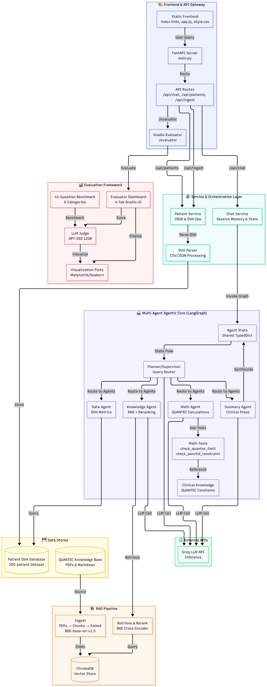

<header class="hero">
  <h1>RadExplain</h1>
  
A Multi-Agent AI System for Clinical Radiation Oncology Decision Support

  
  

    

      Arpan Bhowmik
      Lead Software Engineer Samsung R&D Institute Bangladesh
    

    

      Sarna Rani Bhaduri
      Rajshahi University
    

  

</header>

<strong>RadExplain</strong> combines a LangGraph-orchestrated agent pipeline with Retrieval-Augmented Generation (RAG) over QUANTEC literature to provide evidence-based dose safety assessments, treatment plan summaries, and clinical guideline interpretation.

<h2>Architecture</h2>

<h2>Example Queries</h2>

<strong>Clinical AI Assistant Dashboard</strong>

<h3>1. Treatment Plan Summary</h3>

  

    <code>Summarise the treatment plan of pt_1</code>
  

  
  

    
<strong>Plan Overview:</strong> Curative intent plan delivering high-dose radiation to three PTVs. Parotid glands and mandible exceed QUANTEC recommendations.

    
    <table>
      <thead>
        <tr>
          <th>Structure</th>
          <th>Dose</th>
          <th>QUANTEC Limit</th>
          <th>Status</th>
        </tr>
      </thead>
      <tbody>
        <tr>
          <td>Brainstem</td>
          <td>40.4 Gy</td>
          <td>&le; 54 Gy</td>
          <td>✅ Safe</td>
        </tr>
        <tr>
          <td>Spinal Cord</td>
          <td>32.0 Gy</td>
          <td>&le; 50 Gy</td>
          <td>✅ Safe</td>
        </tr>
        <tr>
          <td>Left Parotid</td>
          <td>61.7 Gy mean</td>
          <td>&le; 20 Gy</td>
          <td>❌ Violated</td>
        </tr>
        <tr>
          <td>Right Parotid</td>
          <td>56.3 Gy mean</td>
          <td>&le; 20 Gy</td>
          <td>❌ Violated</td>
        </tr>
        <tr>
          <td>Mandible</td>
          <td>73.8 Gy</td>
          <td>&le; 70 Gy</td>
          <td>❌ Violated</td>
        </tr>
      </tbody>
    </table>
    
    

      <strong>⚠️ SpinalCord:</strong> Only 62.5% of volume inside calculation grid — reported Dmax may underestimate true maximum dose. Verification recommended.
    

  

<h3>2. OAR Violation Detection</h3>

  

    <code>Which OARs are violated in patient with id pt_1's plan?</code>
  

  

    
Agent Trace (Simplified)

    1. Supervisor → Data Agent: retrieve all OAR doses for pt_1 
    2. Data Agent → Database: query all metrics 
    3. Supervisor → Math Agent: check all OARs against QUANTEC 
    4. Math Agent (deterministic limits): 
       &nbsp;&nbsp;&nbsp;✅ Brainstem 4040.9 cGy — passes 5400 cGy limit 
       &nbsp;&nbsp;&nbsp;✅ SpinalCord 3202.6 cGy — passes 5000 cGy limit   
       &nbsp;&nbsp;&nbsp;❌ Mandible 7376.1 cGy — FAILS 7000 cGy limit by 376.1 cGy 
       &nbsp;&nbsp;&nbsp;❌ Parotids — neither QUANTEC rule met 
    5. Supervisor → Summary Agent: generate clinical report
  

  

    
Mandible and both parotid glands violated. Brainstem and spinal cord within tolerance.

  

<h3>3. Reliability Warning (Agent vs Baseline)</h3>

  

    <code>Is pt_10 brainstem dose safe?</code>
  

  

    
The reported brainstem maximum dose of 3.26 Gy (325.9 cGy) is far below the QUANTEC limit of 54 Gy — safety margin of 50.74 Gy.

    
    

      <strong>⚠️ Reliability Warning:</strong> Only 17.89% of the brainstem volume falls within the calculation grid. The reported Dmax reflects only a small peripheral fragment of the brainstem. The dose to approximately 82% of the structure is unknown. Clinical verification is strongly recommended before concluding the brainstem is safe.
    

  

  

    
The brainstem dose of 3.26 Gy is well within the safe limit of 54 Gy. No concerns identified.

  

  
<em>Notice how the standard baseline missed the calculation volume warning — a clinically significant safety hazard.</em>

<h3>4. Clinical Knowledge & Guideline Retrieval</h3>

  

    <code>What complications are associated with high mandible dose?</code>
  

  

    
Agent Trace (Simplified)

    1. Supervisor → Knowledge Agent: retrieve clinical literature regarding mandible dose complications 
    2. Knowledge Agent → RAG Pipeline: 
       &nbsp;&nbsp;&nbsp;a. Embed query using BGE-base-en-v1.5 
       &nbsp;&nbsp;&nbsp;b. Semantic search in ChromaDB across QUANTEC PDFs 
       &nbsp;&nbsp;&nbsp;c. Cross-encoder reranking of top-10 chunks using BGE-reranker-base 
    3. RAG Pipeline → Knowledge Agent: Returns top-3 highly relevant clinical text chunks 
    4. Supervisor → Summary Agent: generate clinical response based on retrieved evidence
  

  

    
According to the QUANTEC guidelines, the primary complication associated with high radiation dose to the mandible is Osteoradionecrosis (ORN). The risk of ORN increases significantly when the maximum dose exceeds 70 Gy. Preventive measures such as pre-radiotherapy dental evaluation and maintaining excellent oral hygiene are strongly recommended to mitigate this risk.

  

<h2>Evaluation Results</h2>

The multi-agent system is benchmarked against a baseline LLM (no RAG, no specialized tools) on a 41-question clinical dataset. The results are scored by an LLM-as-a-Judge (GPT-OSS 120B).

<strong>Interactive Evaluation Dashboard</strong>

<h3>1. RadExplain vs Baseline by Category</h3>

<h3>2. Overall Performance Comparison</h3>

<h3>3. Question-Level Heatmap</h3>

<h3>4. RAG Retrieval Performance</h3>

<h2>Key Design Decisions</h2>
<table>
  <thead>
    <tr>
      <th>Decision</th>
      <th>Rationale</th>
    </tr>
  </thead>
  <tbody>
    <tr>
      <td><strong>LangGraph StateGraph</strong></td>
      <td>Enables a cyclic Planner → Agent → Planner loop, allowing multi-step reasoning across agents</td>
    </tr>
    <tr>
      <td><strong>Deterministic Math Tools</strong></td>
      <td>QUANTEC safety checks use hardcoded Python functions (not LLM generation) to eliminate numerical hallucinations</td>
    </tr>
    <tr>
      <td><strong>BGE Cross-Encoder Reranking</strong></td>
      <td>Two-stage retrieval (embedding similarity → cross-encoder reranking) maximizes precision of clinical evidence</td>
    </tr>
    <tr>
      <td><strong>Organ-Aware Retrieval</strong></td>
      <td>RAG queries are filtered by detected organ to prevent cross-organ contamination in retrieved chunks</td>
    </tr>
    <tr>
      <td><strong>LLM-as-Judge Evaluation</strong></td>
      <td>GPT-OSS 120B scores responses on a 0-100 rubric with structured pass/fail classification</td>
    </tr>
    <tr>
      <td><strong>Separate Baseline Runner</strong></td>
      <td>Enables direct A/B comparison: same questions evaluated by raw LLM vs. full agentic pipeline</td>
    </tr>
  </tbody>
</table>

<h2>Tech Stack</h2>
<table>
  <thead>
    <tr>
      <th>Component</th>
      <th>Technology</th>
    </tr>
  </thead>
  <tbody>
    <tr>
      <td><strong>Backend</strong></td>
      <td>FastAPI &middot; Uvicorn</td>
    </tr>
    <tr>
      <td><strong>Agent Orchestration</strong></td>
      <td>LangGraph (LangChain)</td>
    </tr>
    <tr>
      <td><strong>LLM</strong></td>
      <td>LLaMA 3.3 70B via Groq</td>
    </tr>
    <tr>
      <td><strong>Judge LLM</strong></td>
      <td>GPT-OSS 120B via Groq</td>
    </tr>
    <tr>
      <td><strong>Embeddings</strong></td>
      <td>BGE-base-en-v1.5 (HuggingFace)</td>
    </tr>
    <tr>
      <td><strong>Reranker</strong></td>
      <td>BGE-reranker-base (Cross-Encoder)</td>
    </tr>
    <tr>
      <td><strong>Vector Store</strong></td>
      <td>ChromaDB</td>
    </tr>
    <tr>
      <td><strong>Frontend</strong></td>
      <td>Vanilla HTML/CSS/JS</td>
    </tr>
    <tr>
      <td><strong>Evaluation UI</strong></td>
      <td>Gradio</td>
    </tr>
    <tr>
      <td><strong>Visualization</strong></td>
      <td>Matplotlib &middot; Seaborn</td>
    </tr>
  </tbody>
</table>
